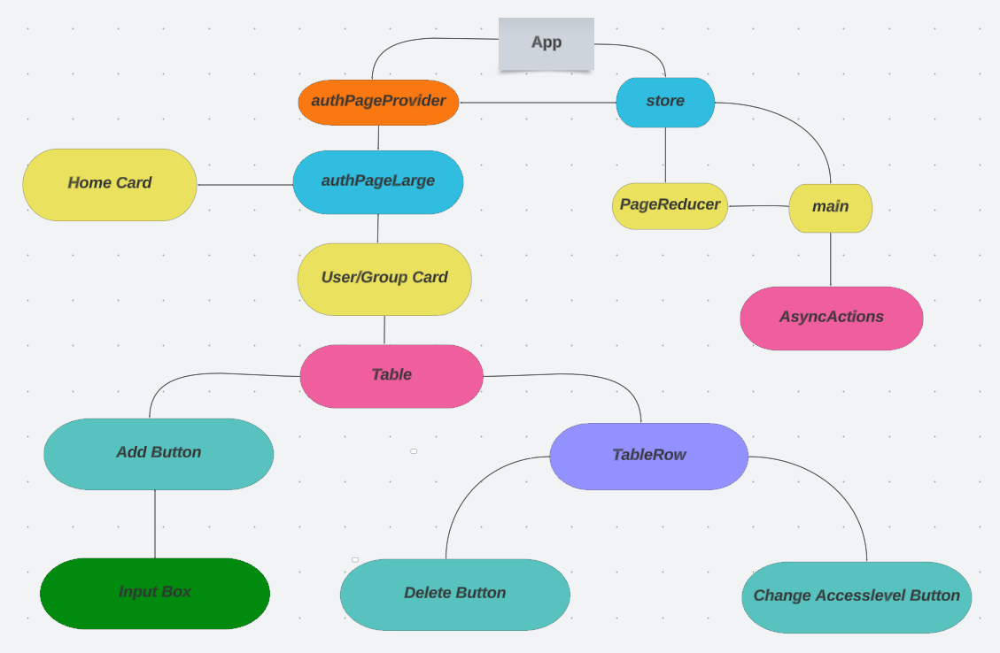

# Project Workflow

Contributors: Minh Quang Bui - Quang Tai Do

## How to run:

1. Open new terminal and run command `npm start`

## Features:

### 1. Edit access level of user and group.

### 2. Remove a user from the table.

### 3. Add a user to the table.

### 4. Add a group from the table.

### 5. Remove a group from the table.

# Assignments:

# Code Structure Diagram:

# Process of project

1. 18.4 : First commit on github and first project day.
   (Create a table with some simple functions)

2. 19.4 - 10-5: Had a consultation with teacher, tried to develop further, added some css, created reducer.

3. 11.5 - 15.5: Worked with reducer, store, fixed buttons.

4. 17.5: Had an another consultaton with teacher on class in order to know more about what we're going to do.

5. 18.5 - 23.5: Worked with redux store and be able to dispatch actions and reducer for buttons.

6. 24.5: Project Day 2

7. 25.5 - 30.5: Waited for the teacher to edit and add the requirements of the topic that he has given via mail on the server.

8. 1.6: Sucessfully fetched data from server GQL and put it into store.

9. 2.6 - 5.6 : Added mutation sucessfully, tried to add user by using query UserbyId but failed to update store.

10. 5.6: Second online consultation with teacher and with the help of teacher, we were able to update the valid of user.

11. 8.6 - 13.6 : Made changes to adding or removing group in page, optimized code.

12. 15.6: Made changes to remove user/group in page, optimized code and added css. (After 3rd online Consultation)

13. 16.6: Made changes to access level button for both group and user. (Using user/group update)

14. 19.6: Replaced fetch function with authorizedFetch and optimized css.
